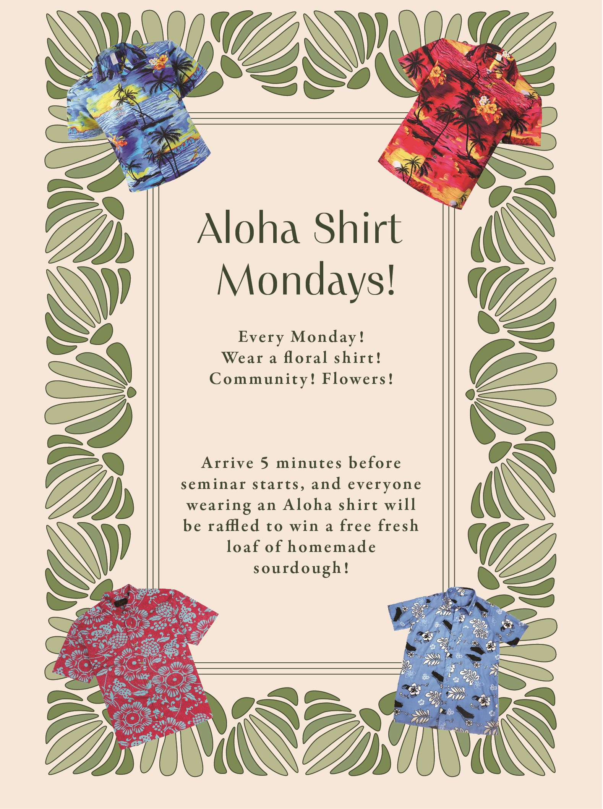

Science communication is a priority for me. To help with this goal, I took a science illustration course at NAU with Victor Leshyk. Some examples of flyers I have made for various outreach events are included below. 

## Science on Tap

Science on Tap is a monthly talk series hosted by the Biological Sciences Graduate Student Association (BGSA) at NAU. Every month, a different speaker gives a talk to the public at a local brewery, Mother Road. I presented a talk on plant-fungal interactions in September 2024.

## Aloha Shirt Mondays

I created Aloha Shirt Mondays as a way to increase attendance at the Biology Departmental seminars and to improve a feeling of unity among people interested in Biology in Flagstaff. Every week, I bring a homemade loaf of sourdough bread to the seminar, and anyone wearing an Aloha shirt (or something even similar) is entered into a raffle to win the loaf of the week.