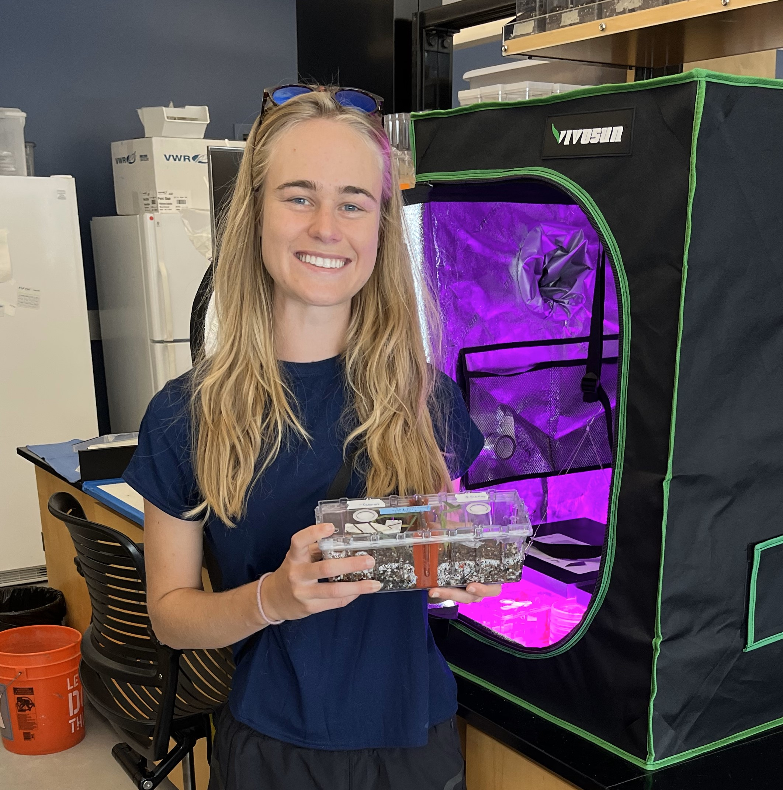

# Bea Bock's research website

Advisors: Dr. Catherine Gehring Dr. Nancy Johnson

# About Me

Bea Bock is a third-year PhD student at Northern Arizona University in Flagstaff, AZ expecting to graduate in Spring 2026. She studies plant root-fungal symbioses and is interested in fungal networks facilitating resource transfers among plants. In her free time, she loves the outdoors access in Flagstaff and enjoys trail running, hiking, mushroom hunting, and kayaking.

{width="427"}

# Dissertation Chapters:

-   Systematic analysis of the fungal endophyte literature using natural language processing

-   Root fungal symbioses of native cottonwoods and invasive tamarisks depending on neighbor and drought

-   Assessing the ability of non-mycorrhizal fungi to form common fungal networks among plants

# Publications:

Orcid ID: <https://orcid.org/0000-0003-2240-9360>   

**Bock, B.**, & Markovchick, L. (2023). Considering Soil Biota and Symbioses in Forest Management and Ecosystem Restoration. Forests, 14(6), 1236. <https://doi.org/10.3390/f14061236>

**Bock, B.M.**, Darroch, S. A. F., & Casey, M. (2023). Long-term changes in unionid community in Kentucky Lake: Implications for understanding the effects of impoundment on river systems. Journal of Freshwater Ecology, 38(1), 2203712. <https://doi.org/10.1080/02705060.2023.2203712>

Sperling, E. A., Melchin, M. J., Fraser, T., Stockey, R. G., Farrell, U. C., Bhajan, L., Brunoir, T. N., Cole, D. B., Gill, B. C., Lenz, A., Loydell, D. K., Malinowski, J., Miller, A. J., Plaza-Torres, S., **Bock, B.**, Rooney, A. D., Tecklenburg, S. A., Vogel, J. M., Planavsky, N. J., & Strauss, J. V. (2021). A long-term record of early to mid-Paleozoic marine redox change. Science Advances, 7(28), eabf4382. <https://doi.org/10.1126/sciadv.abf4382>
